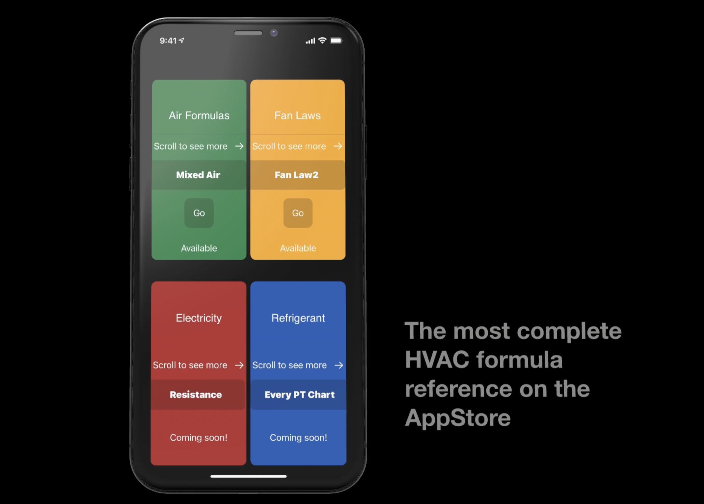
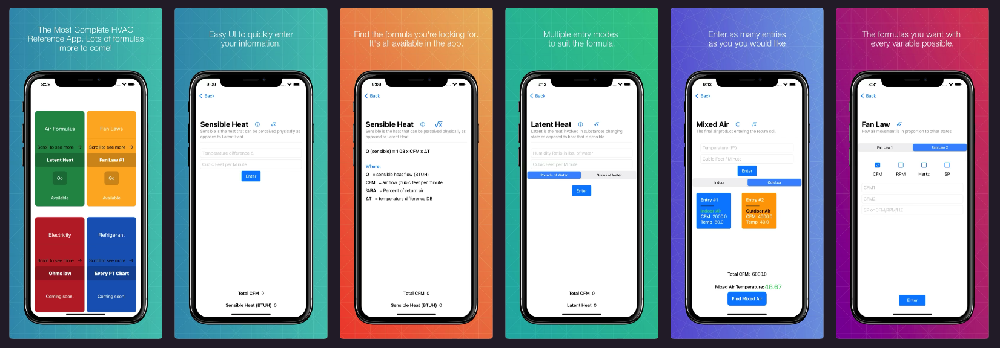

# HVAC Formulas

> ## Thank you for taking the time to check out my HVAC App. 
### This app is pretty significant to me for the following reasons:

TL;DR:
1. It represents my transition from HVAC to Software Development
2. First app that solved a personal problem of my peers and I

---

I have always been interested with mobile development. Prior to being an iOS Developer I was an HVAC technician taking college courses for my profession.
I noticed that a lot of the formulas we were currently learning required multiple inputs. For example the formula for finding any mixed air temperature involves 
inputting the outdoor air temperature along with its CFM (Cubic feet / minute) and the indoor air temperature along with its CFM. So it was very common that one 
mathemetical equation require the results of other depedent mathematical equations. 

  At the time I was also learning SwiftUI - the newest declarative UI framework from Apple - and saw the opportunity to make my life a lot easier! So I created the 
  app and submitted it to the AppStore and told my fellow students about it. They loved it and it became a hit amongst my peers as it solved a mutual problem: The 
  math procedure required to yield the correct answer was now simplified! This not only gave me great motivation but also gave me the inner conviction needed to leave 
  a great a career, HVAC, for one that is a passion for me. Software development, and the coding required to render its components, is great. However, what is even greater 
  than all of that for me is the concept of leveraging the latest technology to make lives easier.
  
  ---
  
  
  
  If you have no need for the services the app offers and would just like to check it out for other purposes. Please [email me.](mail@sergio.dev) 
  I would be happy to share free download coupons!

© 2021 Sergio Bost [Licensed under MIT License](LICENSE)
